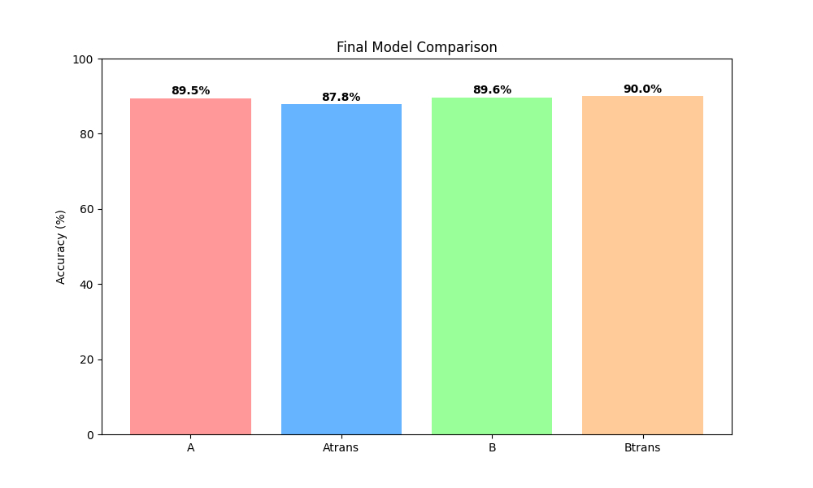
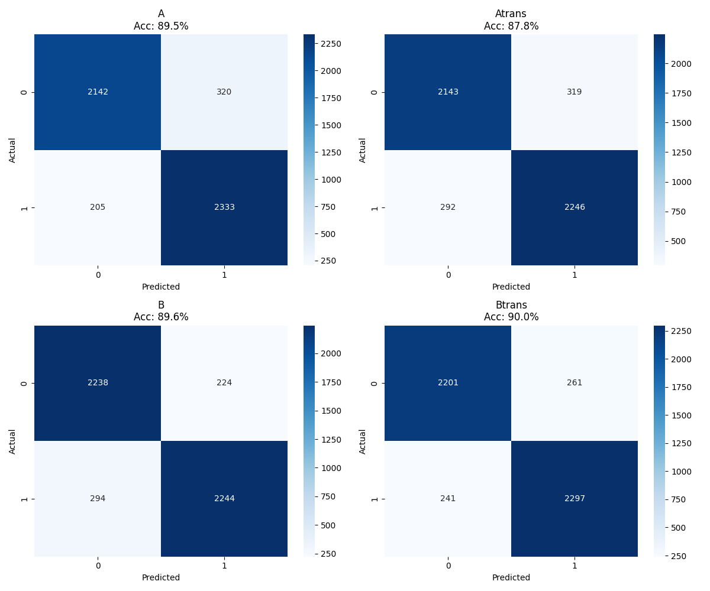

# RNN Sentiment Analysis (LSTM vs Bi-GRU + GloVe)

This project builds and evaluates recurrent neural network models for binary sentiment analysis on movie reviews.

## Problem
Binary text classification:
- Positive
- Negative

## Models
- LSTM (Model A)
- Bidirectional GRU (Model B)

Each model was tested in two settings:
- training from scratch
- transfer learning using pretrained GloVe embeddings

## Data Processing
- CSV loading with pandas
- text tokenization using Keras Tokenizer
- sequence padding to fixed length
- label encoding
- train/validation/test split (80/10/10)

## Transfer Learning
Pretrained GloVe embeddings were loaded into the embedding layer to compare learned embeddings vs fixed pretrained word vectors.

## Reported experiment results

The values below are retained from the original report, alongside the committed result figures. This documentation update did not retrain the models. The evaluation script evaluates saved models on the held-out test split.

### Accuracy Comparison


### Confusion Matrices


### Final Accuracy
- LSTM (Scratch): 89.5%
- LSTM (GloVe): 87.8%
- Bi-GRU (Scratch): 89.6%
- Bi-GRU (GloVe): 90.0%

## Key Insights
- Bi-GRU with GloVe achieved the best overall accuracy
- the effect of pretrained embeddings differed by architecture
- model architecture had a measurable effect on classification quality

## Project Structure
```text
rnn-sentiment-analysis/
├─ src/
│  ├─ dloader.py
│  ├─ experiments.py
│  ├─ gloader.py
│  ├─ main.py
│  ├─ models.py
│  ├─ results.py
│  ├─ train.py
├─ results/
│  ├─ Final_Accuracy_Chart.png
│  ├─ Final_Confusion_Matrices.png
├─ README.md
├─ requirements.txt
├─ .gitignore
```

## Setup and run

The review dataset and GloVe vectors are external inputs, rather than included files. Create a local `data/` folder containing:

- `dataset.csv`: columns `text` and `label`, or `review` and `sentiment`. Supply positive/negative movie reviews with consistent labels.
- `glove.txt`: pretrained GloVe vectors with **100 dimensions**, matching the embedding configuration.

The vocabulary is limited to 20,000 tokens and sequences are padded to length 200. Tokenizer fitting uses the training split. The data split uses seed 42.

PowerShell, from the repository root:

```powershell
python -m venv .venv
.\.venv\Scripts\python.exe -m pip install -r requirements.txt
.\.venv\Scripts\python.exe src/main.py
```

The entry point trains all four configurations, then runs the evaluation script. Keep the exact dataset, embedding source and software versions with a new run if comparing against the historical figures.

## Interpretation

In the reported run, Bi-GRU with GloVe reached 90.0%, but GloVe reduced the LSTM result compared with learned embeddings. This experiment supports comparing architecture and embeddings together; it does not show that pretrained vectors always improve classification. Dataset provenance and full run metadata should accompany a future reproducible benchmark.
